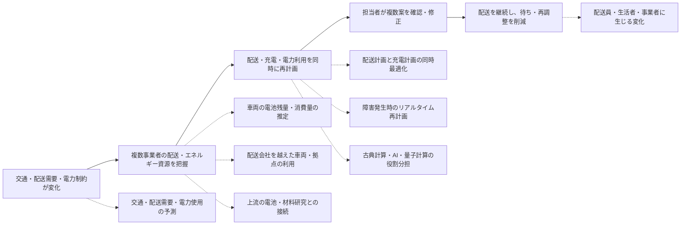
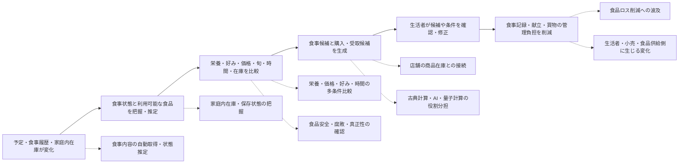
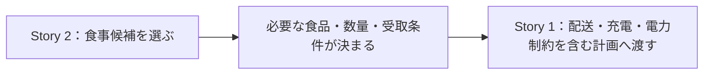

# Explore Use Cases｜背景アイデア整理完了版

---

# 根拠資料

| 資料 | 使用箇所 |
|---|---|
| `ワークショップ_アイデアまとめ.xlsx` の `アイデア` シート | Idea ID、Workshop ID、アイデア原文、ログ、実現に必要なもの、カテゴリ、記述タイプ、収集方法、備考 |
| `ワークショップ_アイデアまとめ.xlsx` の `ワークショップ実施概要` シート | ワークショップの名称、対象、記録方法等の確認 |
| `ワークショップ_アイデアまとめ.xlsx` の `検討したアイディアまとめ` シート | 過去の解釈・発展案の参考。原文の正本としては使用しない |
| `explore_use_cases_content_design_workplan_ja.md` | 背景アイデア整理からストーリー・シード設計までの作業範囲 |
| `BoF準備工程表_2026` | 背景アイデア整理の完了条件 |
| [IEEE Quantum Week 2026 Conference Topics](https://qce.quantum.ieee.org/2026/conference-topics/) | Explore Use Casesで扱う量子・古典ハイブリッド、アプリケーション、最適化、AI、検証、プライバシー等の技術・応用範囲 |
| `QCE26_proposal_2111 (2).pdf`（Developing Quantum Use Cases from Future Everyday Life Scenarios） | BoFの目的、基本アプローチ、ストーリー形式、共通未来条件、議論観点、技術レビュー条件、および配送・エネルギーに関する例示 |
| [アイデア評価フレームワーク ver.2（Miro）](https://miro.com/app/board/uXjVHc6aCAo=/) | タイムスケールをTRL7到達時期、革新性をTRL9到達時の差別化・インパクトとして評価する方法 |

参加者氏名、メールアドレス、個人を識別できる属性、編集用URLは使用しない。詳細な資料の使い方、スコープ設定、正規化・評価方法はAppendixにまとめる。


---

# 関連アイデアの抽出・正規化

全231件を検索母集団とし、交通・配送および食料・栄養に関係する21件を中核分析対象とした。抽出条件と正規化方法はAppendixに示す。


## Evidence列の定義

Evidence列は、アイデアの価値や将来性ではなく、**元資料からどの程度具体的に意味を確認できるか**を示す。

| Evidence | 定義 | 正規化時の扱い |
|---|---|---|
| A | アイデア原文に加え、ログ、実現に必要なもの、備考等に具体的な説明があり、中心的な意味を確認できる | 原文と補足を用いて、比較的具体的な正規化文を作成できる |
| B | アイデア原文と短い補足があり、中心的な意味は確認できるが、利用場面や実現方法の一部が不明である | 明示されている範囲だけを正規化し、不足部分は追加しない |
| C | ポストイット、短文、Word cloud等の短い記録のみで、意味の幅が広い | 原文に最も近い最小限の正規化にとどめ、詳細な意図や実現方法を推測しない |

Evidenceが低いことは、アイデアの重要性が低いことを意味しない。ストーリーやシードへ採用する場合は、元資料だけでは不足する部分を、後続工程で仮定またはOpen Questionとして明示する。

## 中核分析対象

| Idea ID | Domain | Original Idea | Normalized Idea | Evidence |
|---|---|---|---|---|
| IDEA2034 | 交通・配送 | 配達時間なし | 利用者が特定の配達時間帯を指定したり、自宅で待機したりしなくても荷物を受け取れる。 | C |
| IDEA10064 | 交通・配送 | いろんな忙しい友達のスケジュール共有／「日程調整」という概念の消滅 | 複数人の予定を必要最小限だけ共有し、手作業の日程調整を不要にする。 | A |
| IDEA2604 | 交通・配送 | Urban mobility optimization: Quantum algorithms could calculate real-time routes for logistics and traffic signals to eliminate congestion entirely. | 物流車両と交通信号の経路・制御を動的に調整し、都市の混雑を減らす。 | C |
| IDEA2614 | 交通・配送 | Route Optimisation | 多数の経路候補から、目的と制約に合うルートを選択する。 | C |
| IDEA3012 | 交通・配送／食料・栄養 | カップ焼きそばを好きなように食べる | 個人の栄養、価格、旬、好みを考慮して食品・献立を選び、必要な食品や物資を配送する。 | A |
| IDEA2026 | 交通・配送 | auto-driving cooperative vehicle perception | 複数車両が周囲の認識情報と運行状態を共有し、協調して走行する。 | A |
| IDEA2035 | 交通・配送 | 空港での待ち時間なし | 空港利用者が、手続きや乗継ぎのために長時間待たなくてよい。 | C |
| IDEA10045 | 交通・配送 | VR・AR?が普及してカンファレンスとかミーティングとか用の移動がなくなる | 会議やカンファレンスへ参加するための物理的な移動を減らす。 | C |
| IDEA2009 | 交通・配送 | どこに住んでいてもいい | 居住地に左右されず、仕事や日常サービスへアクセスできる。 | A |
| IDEA2064 | 交通・配送／エネルギー | human labour reduced → faster, less-polluting transport | 電池・材料設計と運行の改善を通じて、移動・物流に必要な人手、エネルギー消費、環境負荷を減らす。 | A |
| IDEA3007 | 食料・栄養 | あすけんのもっと自動化版（入力面倒臭いので自動化したい） | 食事記録を手入力せずに栄養状態を把握し、日々の食事選択を支援する。 | A |
| IDEA3005 | 食料・栄養 | 大量の食品ロス0 | 食品の需要と供給を適切に配分し、廃棄される食品を大幅に減らす。 | B |
| IDEA3011 | 食料・栄養 | フードロスのための予想計算 | 食品需要を予測し、複数主体の計画を調整してフードロスを減らす。 | B |
| IDEA3006 | 食料・栄養 | 正確な生産量予測 | 気象、海流、温度などの条件から、食料生産量を精度高く予測する。 | B |
| IDEA3003 | 食料・栄養 | 魚を多く獲れる | 海中の状態を高精度に把握し、漁獲の判断を支援する。 | B |
| IDEA3023 | 食料・栄養 | 漁獲量を安定化 | 漁獲量の大きな変動を抑え、水産物を安定して供給する。 | C |
| IDEA3013 | 食料・栄養 | 食中毒がない | 食品の危険を摂取前に検知し、食中毒を防ぐ。 | B |
| IDEA3008 | 食料・栄養 | 毒を見つける量子センサー／なんでも食べられるようになるマシン | 食品中の毒素を検知し、安全に除去または無効化する。 | A |
| IDEA3021 | 食料・栄養 | アレルギー0 | 食物アレルギーによる制約や事故を減らし、安全に選べる食品を増やす。 | C |
| IDEA3020 | 食料・栄養 | prevent food from rotting? | 食品の腐敗を抑え、保存可能な期間を延ばす。 | C |
| IDEA3014 | 食料・栄養 | 食の生体認証 | 食品固有の特徴を読み取り、産地、個体、真正性、流通履歴を確認する。 | B |

## 正規化上の重要な修正

- `IDEA2604`の「渋滞を完全になくす」は、シナリオ前提ではなく参加者の願望として保持し、正規化では「混雑を減らす」とした。
- `IDEA3005`の「食品ロス0」は絶対達成を仮定せず、「大幅に減らす」とした。
- `IDEA3021`の「アレルギー0」は医学的な完全解消を仮定せず、「制約や事故を減らす」とした。
- `IDEA3008`は「毒素の検知」と「除去・無効化」を独立した技術機能として扱う。
- `IDEA3012`は食事選択と配送の両方を含むため、交通・配送と食料・栄養の橋渡しアイデアとして扱う。
- `IDEA2026`の量子もつれを用いた車両合意は、元記録の提案として保持するが、実現可能な前提として採用しない。
- `IDEA2064`は、電池・材料探索から低負荷な交通・物流へ波及するアイデアであるため、第1テーマに配送とエネルギーを接続する背景として扱う。

---

# アイデアの構成要素への分解

## 交通・配送

| Idea ID | Daily Activity | Current Burden | Desired Change | Product / Service | Technical Function |
| --- | --- | --- | --- | --- | --- |
| IDEA2034 | 荷物を受け取る | 配達時刻に合わせて待機・再調整する | 予定を変えずに受け取る | 予定追従型配送、受取場所切替 | 配送候補探索、時間・場所マッチング、再計画 |
| IDEA10064 | 友人・関係者と予定を合わせる | 空き時間確認、連絡、再調整 | 手作業の日程調整をなくす | プライバシー保護型スケジュール調整 | 候補生成、制約照合、分散・秘匿処理 |
| IDEA2604 | 都市を移動する、物流を運行する | 混雑、遅延、信号待ち | 都市全体の混雑を減らす | 交通・物流統合運用 | リアルタイム経路探索、信号制御、資源配分 |
| IDEA2614 | 目的地まで移動・配送する | 多数の経路を比較できない | 条件に合うルートを選ぶ | 経路選択サービス | 候補経路生成、制約判定、目的値比較 |
| IDEA3012 | 食事を選び、食品を受け取る | 栄養・価格・旬・買物・配送を別々に管理する | 食事と調達を一体で支援する | 献立・調達・配送統合サービス | 多制約候補探索、在庫照合、配送割当 |
| IDEA2026 | 車両を運転・運行する | 一台のセンサーだけでは状況把握が限定的 | 複数車両が協調して安全に走る | 協調走行・遠隔運行 | センサーフュージョン、合意、制御 |
| IDEA2035 | 空港を利用する | 手続き、保安、搭乗、乗継ぎで待つ | 必要な手続きを待たずに進む | 空港手続き統合サービス | 需要予測、処理枠割当、本人確認 |
| IDEA10045 | 会議・カンファレンスへ参加する | 移動時間、費用、身体負担 | 物理移動なしでも参加できる | 遠隔参加・没入型共同作業 | 通信、臨場感提示、共同編集 |
| IDEA2009 | 住む、働く、サービスを利用する | 居住地による機会制約 | 住む場所に縛られない | 遠隔就労・遠隔サービス統合 | 通信、本人確認、サービス連携 |
| IDEA2064 | 配送車両を運行し、充電・エネルギーを確保する | 配送計画と充電・電力利用が別々に管理され、車両を動かせても必要なエネルギーを確保できない | 配送需要とエネルギー制約を一体で扱う | 配送・充電・電力利用の統合運用 | 材料・電池探索、充電計画、電力配分、運行最適化 |

## 食料・栄養

| Idea ID | Daily Activity | Current Burden | Desired Change | Product / Service | Technical Function |
| --- | --- | --- | --- | --- | --- |
| IDEA3007 | 食事を記録・選択する | 入力が面倒、栄養状態を把握しにくい | 記録負担なく適切な選択をする | 自動栄養把握・食事支援 | センシング、状態推定、予測、推薦 |
| IDEA3005 | 食品を生産・販売・購入する | 需要と供給のずれで食品を廃棄する | 廃棄を大幅に減らす | 食品需給・分配プラットフォーム | 需要予測、在庫共有、配分最適化 |
| IDEA3011 | 食品を発注・供給する | 主体ごとの予測誤差と計画不整合 | 協調して過剰生産・欠品を減らす | 共同需要予測・計画サービス | 予測、協調計算、計画調整 |
| IDEA3006 | 食料を生産・調達する | 収量変動や不足を事前に把握しにくい | 生産量を早く正確に見通す | 農業・水産生産予測 | 気象・海流シミュレーション、予測 |
| IDEA3003 | 漁場を探し、漁獲する | 魚群や海中状態を把握しにくい | 漁獲判断を改善する | 高精度漁場把握サービス | ソナー・センシング、位置推定 |
| IDEA3023 | 水産物を生産・供給する | 漁獲量の変動が大きい | 持続的に供給を安定させる | 漁獲・在庫・流通調整 | 資源予測、割当、需給調整 |
| IDEA3013 | 食品を選び、食べる | 危険を外見から判断できない | 食べる前に危険を知る | 食品安全チェック | 病原体・毒素検出、分類 |
| IDEA3008 | 食品を選び、調理する | 毒素を検知・除去できない | 危険な食品を安全にする | 毒素検知・無効化装置 | 高感度検知、選択的除去・反応制御 |
| IDEA3021 | 食品を選び、外食する | アレルゲンや個人反応の制約 | 安全に選べる食品を増やす | 個人別アレルギー安全支援 | アレルゲン検出、個人状態照合、代替提案 |
| IDEA3020 | 食品を保存・消費する | 腐敗による廃棄と安全不安 | 保存期間を延ばす | 保存状態監視・腐敗抑制 | 腐敗検知、包装・材料・環境制御 |
| IDEA3014 | 食品を購入・流通する | 産地偽装や真正性を確認しにくい | 食品の由来を信頼して確認する | 食品真正性・履歴確認 | 光学的特徴抽出、照合、台帳連携 |

---


# 生活変化を軸にしたグループ化

第一軸を「望ましい生活変化」、第二軸を「日常活動・生活領域」とする。技術名は補助情報とし、グループ名には使用しない。

| 望ましい生活変化 | 主な日常活動 | Source Idea IDs | ストーリー化の方向 |
|---|---|---|---|
| 待つこと・予定調整から解放される | 荷物受取、日程調整、空港利用 | IDEA2034, IDEA10064, IDEA2035 | BtoB側の構造変化が生活者にもたらす結果として描ける |
| 物理的な場所に縛られず参加・生活できる | 会議参加、就労、居住 | IDEA10045, IDEA2009 | 生活圏の自由を描けるが範囲が広い |
| 事業者を越えて配送資源とエネルギー資源を組み替えられる | 配送計画、車両・拠点割当、充電計画、電力配分、企業間連携 | IDEA2604, IDEA2614, IDEA3012, IDEA2026, IDEA2064 | BtoB側の構造変化を描く中心テーマに適する |
| 移動の人手・エネルギー消費・環境負荷を減らす | 交通・物流運用 | IDEA2064 | 第1テーマにエネルギー側の目的と技術背景を与える |
| 栄養管理を意識しすぎずに食事を選べる | 食事記録、献立、買物、受取 | IDEA3007, IDEA3012 | 個人の日常ストーリーとして明確 |
| 需要と供給のずれを減らし、食品を捨てない | 発注、生産、販売、配分 | IDEA3005, IDEA3011, IDEA3006 | 供給網のストーリー、または個人の食事選択を支える背景に適する |
| 食料資源の状態を把握し、供給を安定させる | 漁獲、生産、調達 | IDEA3003, IDEA3023, IDEA3006 | 生産者側のストーリー向き |
| 食べる前に危険を知り、安全に選べる | 食品選択、調理、外食 | IDEA3013, IDEA3008, IDEA3021 | 食品安全の独立ストーリーに適する |
| 食品を長く、安全に、信頼して利用できる | 保存、購入、流通確認 | IDEA3020, IDEA3014 | 保存・真正性の背景、または別ストーリー向き |

## グループ間の関係

```text
事業者横断の配送・エネルギー資源調整
        ↓ results in
待機・日程調整からの解放

食品の需給調整
        ↓ supports
個人に合った食事選択と調達

生産・漁獲の安定
        ↓ supplies
食品の需給調整

食品安全
        ↓ constrains
個人に合った食事選択

保存・真正性
        ↓ supports
食品の需給調整
```

## グループ化の決定

- 第1テーマでは、「複数事業者が配送資源とエネルギー資源を横断的に調整する」を中心とする。車両・倉庫・受取拠点だけでなく、充電設備、充電枠、車両の電池状態、拠点の利用可能電力を配送計画と同時に扱う。「待つこと・予定調整から解放される」は、その構造変化が生活者にもたらす結果として接続する。
- 食料・栄養では、「栄養管理を意識しすぎずに食事を選べる」を中心生活変化とし、食品の需給調整と食品安全を背景条件として接続する。
- 場所に縛られない生活、生産・漁獲、保存・真正性は初期MVPの中心から外すが、将来のストーリー候補として保持する。移動のエネルギー消費と環境負荷は第1テーマへ統合する。
- 同じSource Ideaが複数の生活変化に関係する場合は、複数箇所で参照できる。特にIDEA3012は配送と食事の橋渡しとして保持する。

---

# 技術スコープとの互換性判定

社会的条件はこの段階では判定対象に含めず、IEEE Quantum Week 2026 Conference Topicsから設定した技術・応用範囲との接続だけを確認する。

## 判定区分の定義

| 判定 | 定義 | この資料での扱い |
|---|---|---|
| Compatible | 現在設定している技術スコープと技術前提の範囲内で、ストーリーまたはアイデアシードとして扱える | 中心候補または補助候補として残す |
| Requires Extension | 現在の技術前提だけでは成立せず、追加のデータ、センシング、通信、計算基盤、材料、検証方法等が必要である | 必要な技術拡張を明示したうえで候補として保持する |
| Challenges Premise | 完全達成、万能な自動化、無制限な精度等を暗黙に仮定しており、現在の技術前提と衝突する | 絶対表現をそのまま採用せず、実現可能な変化へ正規化する |
| Outside Scope | アイデア自体には価値があるが、今回の初期テーマまたは技術・応用範囲との接続が弱い | 削除せず、将来候補またはアーカイブとして保持する |

この判定は、アイデアの優劣を示すものではない。現在の技術スコープとの接続方法と、追加で必要な前提の有無を整理するために用いる。

## 判定表

| Idea ID | 判定 | Related Technical Premises | 判定理由・必要な技術拡張 |
|---|---|---|---|
| IDEA2034 | Compatible | TP-02, TP-03, TP-04, TP-06 | 配送候補探索、時間・場所マッチング、再計画として扱える。完全な無待機は仮定しない。 |
| IDEA10064 | Compatible | TP-02, TP-04, TP-06 | スケジュール候補生成、制約照合、複数システム間の調整として扱える。 |
| IDEA2604 | Requires Extension | TP-03, TP-04, TP-05 | 都市規模のリアルタイムデータ、信号制御、物流資源の統合基盤が必要である。 |
| IDEA2614 | Compatible | TP-04, TP-06 | 候補経路生成、制約判定、目的値比較、古典検証の構造で扱える。 |
| IDEA3012 | Compatible | TP-02, TP-03, TP-04, TP-06 | 多制約候補探索、在庫照合、配送割当として扱える。 |
| IDEA2026 | Requires Extension | TP-03, TP-05 | 車載センシング、低遅延通信、複数車両の協調制御が必要である。元の量子もつれ案は前提化しない。 |
| IDEA2035 | Requires Extension | TP-02, TP-03, TP-04 | 空港内の需要・処理枠・本人確認システムを連携する基盤が必要である。 |
| IDEA10045 | Outside Scope | TP-05 | 初期の配送・食事テーマから離れ、量子計算機能との接続も弱い。 |
| IDEA2009 | Outside Scope | TP-05 | 居住、就労、公共サービス全体を含み、初期MVPの一ストーリーとして広すぎる。 |
| IDEA2064 | Requires Extension | TP-03, TP-04, TP-05 | 配送計画に車両の電池状態、充電設備、充電時間、拠点の電力容量を組み込む必要がある。材料・電池探索は上流の補助技術として扱う。 |
| IDEA3007 | Compatible | TP-02, TP-03, TP-06 | 食事状態の取得、推定、推薦、利用者による確認・修正として扱える。 |
| IDEA3005 | Challenges Premise | TP-02, TP-04 | 「ロス0」は完全最適化を仮定するため採用せず、「大幅に減らす」へ正規化する。 |
| IDEA3011 | Compatible | TP-02, TP-03, TP-04 | 需要予測、複数主体の計画調整、配分最適化として扱える。 |
| IDEA3006 | Requires Extension | TP-03, TP-05 | 気象・海流・生産データと、大規模シミュレーション基盤が必要である。 |
| IDEA3003 | Requires Extension | TP-03 | 高精度ソナー、海中センシング、魚群位置推定が必要である。 |
| IDEA3023 | Requires Extension | TP-03, TP-04 | 資源量予測、漁獲・在庫・流通の統合モデルが必要である。 |
| IDEA3013 | Compatible | TP-03, TP-06 | 病原体・毒素の検知、分類、結果提示として扱える。 |
| IDEA3008 | Requires Extension | TP-03, TP-06 | 毒素検知に加え、選択的除去・無効化の材料・化学技術が必要である。 |
| IDEA3021 | Challenges Premise | TP-03, TP-06 | 「アレルギー0」は完全解消を仮定するため採用せず、安全な選択支援へ再定義する。 |
| IDEA3020 | Requires Extension | TP-03 | 腐敗検知、保存材料、包装、環境制御の技術前提が必要である。 |
| IDEA3014 | Requires Extension | TP-02, TP-03 | 食品固有特徴の取得、登録、照合、流通データ連携が必要である。 |

## 判定結果の要約

| 判定 | 件数 |
|---|---:|
| Compatible | 7 |
| Requires Extension | 10 |
| Challenges Premise | 2 |
| Outside Scope | 2 |
| 合計 | 21 |

## 次工程へ渡すルール

- `Compatible`は中心ストーリーまたはシード候補にできる。
- `Requires Extension`は、必要な技術要素を明示したうえで候補として保持する。
- `Challenges Premise`は、絶対達成を前提にせず、実現可能な変化へ正規化する。
- `Outside Scope`は削除せず、将来候補またはアーカイブとして保持する。
- 社会的条件は、本M1の採否には使用せず、ストーリー世界または各レンズの設計時に別途扱う。

---

# ストーリー候補の評価・選定

第1テーマと第2テーマはいずれも、**2035年を舞台とする探索シナリオ**として扱う。現在から約10年先に起こり得るサービス・業務構造の変化を描き、量子技術の利用は確定事項ではなく検討対象として残す。

## 候補評価

| Story Theme | 主な変化・Source Idea IDs | 主体 | 変化 | 根拠 | 技術接続 | 展開性 | 独自 | 物語 | Total | Decision |
|---|---|---|---:|---:|---:|---:|---:|---:|---:|---|
| 複数事業者が配送資源とエネルギー資源を横断的に調整する | 企業単位で分断された配送計画と充電・電力利用を統合し、車両・倉庫・受取拠点・充電設備・配送枠を事業者横断で再割当する構造へ／IDEA2604, IDEA2614, IDEA3012, IDEA2026, IDEA2064, IDEA2034 | BtoB | 5 | 5 | 5 | 5 | 5 | 5 | 35 | Adopt：第1テーマ |
| 栄養管理を意識しすぎずに食事を選ぶ | 食事記録・献立・在庫・購入・配送を一つの選択過程として扱う／IDEA3007, IDEA3012, IDEA3011, IDEA3013 | BtoC | 5 | 5 | 5 | 5 | 5 | 5 | 35 | Adopt：第2テーマ |
| 配送会社ごとに受取手続きをしなくてよい | 待機・個別調整からの解放／IDEA2034, IDEA10064, IDEA2035 | BtoC | 4 | 4 | 4 | 5 | 3 | 5 | 29 | Merge：最初のテーマが生活者にもたらす結果 |
| 食べられる食品を捨てない供給網 | 食品の需給調整／IDEA3005, IDEA3011, IDEA3006 | BtoB | 5 | 4 | 4 | 5 | 5 | 4 | 31 | Hold：次のBtoBテーマ候補 |
| 食べる前に危険を知る | 食品安全／IDEA3013, IDEA3008, IDEA3021 | BtoC / BtoB | 5 | 4 | 3 | 5 | 4 | 5 | 31 | Hold：技術前提の拡張後 |
| 混雑を避けて動く都市 | 移動・物流の動的調整／IDEA2604, IDEA2614, IDEA2026 | Public / BtoB | 4 | 4 | 4 | 5 | 4 | 3 | 28 | Merge：最初のテーマの都市条件へ |
| 場所に縛られず参加する | 場所からの解放／IDEA10045, IDEA2009 | BtoC | 5 | 3 | 3 | 4 | 3 | 4 | 26 | Exclude：初期MVP外 |
| 食料生産と漁獲を安定させる | 生産・漁獲の安定／IDEA3006, IDEA3003, IDEA3023 | BtoB | 4 | 3 | 3 | 5 | 4 | 3 | 25 | Hold：生産者側ストーリー |
| 食品の真正性と保存を確かめる | 保存・真正性／IDEA3014, IDEA3020 | BtoB / BtoC | 4 | 2 | 3 | 5 | 4 | 4 | 26 | Hold |

## 二つのストーリーの幹

まず、第1・第2テーマについて、ストーリーの中心となる変化を一本の流れとして固定する。
その後、各段階から技術、業務、製品・サービス、量子技術との接点などの関連変化を枝葉として展開する。

### Story 1｜配送・エネルギー



実線がStory 1の**幹**、破線が幹から伸ばす関連変化である。

### Story 2｜食料・栄養



実線がStory 2の**幹**、破線が幹から伸ばす関連変化である。

### 二つのストーリーの接続点

二つのストーリーを一本の因果関係として統合するのではなく、それぞれ独立した幹として保持する。
ただし、Story 2で食品の購入・受取が必要になった段階では、Story 1の配送・エネルギー基盤と接続し得る。



この接続は、二つのストーリーを一つにまとめるためではなく、異なる生活・産業領域の変化がどこで関係するかを示すために用いる。

### 枝葉を追加する際のルール

- 幹の中心変化を変更する内容は、枝葉として追加せず、ストーリー自体の改訂として扱う。
- 一つの枝葉には、一つの機能、変化、関係、または問いだけを置く。
- 元のアイデアとの対応がある場合はSource Idea IDを保持する。
- 技術の説明だけでなく、その技術によって業務や日常行動の何が変わるかを記載する。
- 古典計算、AI、量子計算のどれを使うかは、枝葉の段階では固定しない。
- 枝葉のうち、参加者がさらに展開できるものを後続のIdea Seed候補とする。


## 第1テーマ

### 採用テーマ

> **複数事業者が配送資源とエネルギー資源を横断的に調整する**

### 評価上の位置づけ

| 項目 | 内容 |
|---|---|
| タイムスケール | **2035年（暫定）** |
| タイムスケールの意味 | 配送・充電・電力利用を統合したシステムが、実運用に近い環境でTRL7へ到達する目標時期 |
| 評価対象 | 個別の経路最適化や充電器ではなく、複数事業者の配送資源とエネルギー資源を同時に再計画する統合システム |
| 革新性 | 未採点。TRL9到達時の既存物流システムとの差別化と、配送・エネルギー運用へのインパクトで評価する |

2035年という年は、各要素技術が単独で利用可能になる時期ではなく、**統合された運用システム全体がTRL7に到達する時期**として置く。


### 描く構造変化

現在は、販売事業者、配送事業者、倉庫、受取拠点等が配送を計画する一方で、車両の充電、充電設備の予約、拠点の電力容量、電力価格等は別のシステムや担当者によって管理されることが多い。

そのため、配送に使える車両があっても充電が間に合わない、空いている充電器があっても配送経路から外れる、拠点全体の電力容量を超えるため同時充電できない、といった不整合が起こる。

2035年のストーリーでは、複数事業者が次の資源を一つの候補集合として扱い、配送とエネルギー利用を同時に再計画できる構造を描く。

- 配送案件と配送枠
- 車両と積載容量
- 車両の現在・予測電池残量
- 倉庫、中継拠点、受取拠点
- 充電設備と利用可能時間
- 各拠点で利用可能な電力容量
- 経路、交通状態、所要時間
- 配送期限と充電に必要な時間

生活者が予定を変えずに荷物を受け取れることや、低負荷な輸送が行われることは、このBtoB構造変化によって生まれる結果として扱う。

### 中心となる背景アイデア

- `IDEA2604`：物流車両と交通信号の動的調整
- `IDEA2614`：Route Optimisation
- `IDEA3012`：必要な食品・物資の配送
- `IDEA2026`：複数車両の協調
- `IDEA2064`：電池・材料設計から低負荷な交通・物流への波及
- `IDEA2034`：配達時間なし

### 補助・対照アイデア

- `IDEA10064`：日程調整という概念の消滅
- `IDEA2035`：空港での待ち時間なし

`IDEA2064`は、配送経路の最適化だけでなく、電池・材料、エネルギー消費、環境負荷を交通・物流へ接続する背景アイデアとして位置づける。ただし、材料探索そのものをストーリーの中心業務にはせず、車両の電池状態と充電・電力制約を配送計画へ組み込む。

### QCE26 BoF提案との対応

QCE26 BoF提案のTable Iでは、配送・スケジュールとエネルギーは、それぞれ次のような未来変化として例示されている。

| 提案内の例 | 共有される生活変化 | 提案内の量子技術との関係 | 本テーマでの扱い |
|---|---|---|---|
| 自動日程調整、固定配送時間を必要としない配送、空港での待ち時間削減 | 人が手作業で予定を調整したり、サービスを待ったり、物流上の制約に合わせて活動を変えたりする必要が薄れる | 多数の候補と制約を含むスケジューリング・配送計画を組合せ最適化として扱い、量子アルゴリズムの可能性を検討する | 配送案件、車両、経路、倉庫、受取拠点を横断して再計画する部分に対応する |
| 自己充電デバイス、地域発電、水素エネルギー | 人が充電、電池残量、日常のエネルギー管理を強く意識しなくなる | 太陽電池、熱電、水素関連材料の探索を材料・化学問題として扱い、量子シミュレーションの可能性を検討する | 電池・材料研究を上流要素とし、配送運用側では電池状態、充電設備、電力容量を制約として扱う |

BoF提案では配送とエネルギーは別々の例として示されている。本資料の第1テーマは、それらをそのまま一つの提案例として転記したものではなく、**配送を継続するためにエネルギー管理が不可欠になるBtoB運用構造として再統合したテーマ**である。

したがって、量子技術との関係も一つに固定しない。

- 配送・充電計画の組合せ探索では、量子・古典ハイブリッド最適化の可能性を検討する。
- 電池・発電・水素等の性能向上では、量子シミュレーションを用いた材料・化学研究の成果との接続を検討する。
- これらの量子処理は、古典計算、AI、既存情報基盤を含むシステムの一部として位置づける。


## BtoBストーリーの人物と場面

### 主人公候補

複数の物流事業者と充電・エネルギー設備を調整する、地域物流・エネルギー連携基盤の運用担当者。

### 中心場面候補

猛暑による電力需要の増加、主要充電拠点の設備停止、交通障害、配送需要の急増が同時に起きた日に、複数事業者の車両、配送案件、充電枠、倉庫、中継拠点を組み替える。

### 現在の負担

- 配送計画と充電計画を別々に作る。
- 各事業者へ車両・充電設備の空き状況を個別に確認する。
- 車両の電池残量と将来の消費量を配送計画へ十分に反映できない。
- 充電設備が空いていても、拠点の電力容量や配送経路に合わない。
- 配送を優先すると充電待ちが発生し、充電を優先すると配送期限を満たせない。
- 障害発生時に、配送案件、車両、経路、充電場所を順番に修正するため時間がかかる。
- 配送遅延、充電待ち、消費電力を同時に比較できない。

### 2035年の変化

必要な入力と制約の範囲で、複数事業者の配送資源とエネルギー資源を同時に候補として扱い、人が確認できる複数の再計画案を生成・比較できる。

配送案件を別の車両へ移すだけではなく、次を一体として変更できる。

- 使用する車両
- 配送順序と経路
- 中継・積替え拠点
- 充電する場所と時間
- 充電量
- 拠点ごとの電力利用枠
- 配送案件の分割・統合
- 後続時間帯への資源の残し方

### 技術的な処理構造

```text
配送案件・期限・積載条件
＋
車両・倉庫・受取拠点の稼働状態
＋
車両の電池残量と消費予測
＋
充電設備・充電枠・拠点電力容量
＋
交通状態と将来需要
↓
配送可能性とエネルギー可能性の推定
↓
配送・充電を統合した候補計画の生成
↓
制約検証
↓
複数案の比較
↓
運用担当者による選択・修正
```

### 主な入力

- 配送案件、配送期限、荷物量
- 車両位置、積載容量、稼働可能時間
- 車両の電池残量、充電速度、走行時の消費予測
- 充電設備の位置、空き時間、出力
- 倉庫・中継拠点・受取拠点の処理能力
- 拠点単位で利用できる電力容量
- 道路状態、予測所要時間
- 時間帯別の配送需要

### 主な制約

- 配送期限
- 車両の積載容量
- 走行可能距離と最低電池残量
- 充電設備の対応車種・出力
- 充電設備と拠点電力の同時利用上限
- 倉庫・拠点の処理可能時間
- 車両・運転者・設備の利用可能時間
- 荷物の温度、優先度、取扱条件

### 比較する結果

- 配送完了率と遅延
- 総走行距離と総所要時間
- 充電待ち時間
- 電池切れ・制約違反の有無
- 拠点ごとの電力使用量とピーク
- 使用車両・充電設備の偏り
- 障害発生後に維持できる配送能力
- 条件変更時に残る代替計画数

### 古典計算・AI・量子計算の候補となる役割

| 処理 | 候補となる方法 |
|---|---|
| 交通・配送需要・電力使用の予測 | 統計モデル、機械学習 |
| 車両の電池消費量の推定 | 物理モデル、機械学習 |
| 配送・充電候補の生成 | ルール、探索、古典最適化 |
| 車両・経路・充電枠・拠点の組合せ探索 | 古典最適化、ヒューリスティクス、量子・古典ハイブリッド |
| 制約と実行可能性の検証 | 古典計算、シミュレーション |
| 再計画案の選択・修正 | 運用インターフェース、人の判断 |

量子計算の候補は、車両、配送案件、経路、充電設備、時間枠、電力容量の組合せが大きくなる場合の探索部分である。ただし、2035年に量子計算が古典手法より有効であることは前提にしない。

## 第1テーマで扱うエネルギーの範囲

第1テーマで中心に扱うのは、**配送運用に必要なエネルギーの配置と利用**である。

含めるもの：

- 車両の電池状態
- 充電場所・充電時間・充電量
- 充電設備の利用枠
- 拠点の電力容量
- 配送と充電を同時に決める計画
- 電力制約発生時の配送再計画

中心から外すもの：

- 発電方式そのものの研究
- 電力市場全体の運用
- 新材料・新電池の研究開発プロセス
- エネルギー政策や費用負担の最終設計

新材料・新電池は、将来利用可能な車両性能を変える上流要素として接続するが、ストーリーの中心は配送現場における運行・充電・電力利用の統合とする。

## 次工程で守る境界

- 単一企業の経路最適化ではなく、企業を越えた配送資源とエネルギー資源の再割当を描く。
- 配送計画と充電計画を別々にせず、同じ候補計画の中で扱う。
- 車両の電池状態、充電設備、拠点電力容量を明示的な入力・制約とする。
- エネルギーが無制限に利用できるとは仮定しない。
- 充電設備と入力データが常に利用可能・正確であるとは仮定しない。
- 新電池や量子材料がすべての制約を解消するとは仮定しない。
- 量子計算を必須手段として固定せず、古典手法・AI・人の判断との比較対象として残す。
- データガバナンス、労働、責任、費用配分等の社会的条件は、この段階では確定しない。


## 第2テーマ

### 採用テーマ

> **栄養管理を意識しすぎずに食事を選ぶ**

### 評価上の位置づけ

| 項目 | 内容 |
|---|---|
| タイムスケール | **2035年（暫定）** |
| タイムスケールの意味 | 食事状態・家庭内在庫・商品在庫・献立・購入・配送を統合したシステムが、実生活に近い環境でTRL7へ到達する目標時期 |
| 評価対象 | 個別の食事記録アプリや推薦機能ではなく、状態推定から候補生成、購入・受取までを一体化した統合システム |
| 革新性 | 未採点。TRL9到達時の既存の食事管理・献立推薦・ネットスーパーとの差別化と、生活上のインパクトで評価する |

2035年という年は、画像認識、栄養計算、在庫管理等の個別技術の到達時期ではなく、**実生活で連続運用できる統合システム全体がTRL7に到達する時期**として置く。


### 描く構造変化

現在は、食事記録、栄養確認、献立検索、冷蔵庫の在庫確認、買物、価格比較、配送手配が、それぞれ別の作業やサービスとして分かれている。

利用者は食事のたびに、次の情報を自分で集め、比較し、入力しなければならない。

- 直近に何を食べたか。
- 今日必要な栄養の目安は何か。
- 冷蔵庫や家庭内に何が残っているか。
- どの食材が購入可能か。
- 価格、旬、調理時間、好みに合うか。
- どの商品を、どこから、いつ受け取るか。

未来ストーリーでは、これらを個別の作業として行うのではなく、食事状態、家庭内在庫、商品在庫、価格、調理可能時間、嗜好等を一つの候補生成・選択過程として扱う。

システムが食事を一つに決定するのではなく、条件を満たす複数の食事案を作り、利用者が確認・変更できる構造を描く。

### 中心となる背景アイデア

- `IDEA3007`：食事記録を手入力しない栄養管理
- `IDEA3012`：栄養、値段、旬、好みに基づく食事選択と配送

### 補助・接続する背景アイデア

- `IDEA3011`：食品需要の予測と計画調整
- `IDEA3013`：食べる前の食品安全確認
- `IDEA3005`：食品ロスの削減
- `IDEA3020`：食品の腐敗抑制と保存
- `IDEA3014`：食品の由来・真正性の確認

`IDEA3007`と`IDEA3012`を個人の日常場面の中心に置き、需要予測、食品安全、保存、真正性は候補生成に利用できる追加情報または後続シードとして扱う。

### QCE26 BoF提案との対応

食料・栄養のテーマは、QCE26 BoF提案のTable Iに完成例として直接掲載されているものではない。一方で、提案が定める次の基本アプローチに対応する。

- 既存の量子技術や産業課題から始めず、実現・探究したい日常生活の変化から始める。
- 「将来、意識して管理する負担や制約を減らしたいものは何か」という問いを起点にする。
- 架空の一人の人物、身近な活動または意思決定、技術変化を含む短い未来ストーリーとして表す。
- その変化のどこに量子技術が関係し得るかを、参加者が後から検討する。

第2テーマでは、「栄養管理の正解を自動的に与えること」ではなく、**食事記録、在庫確認、献立比較、購入・受取を毎回意識して管理する負担が減ること**を中心変化とする。

量子技術の利用箇所は事前に固定せず、食事案、食材、商品在庫、価格、時間等の組合せ探索が大規模化する場合に、古典最適化やAIと比較して検討する。


## BtoCストーリーの人物と場面

個人向けサービスの機能一覧だけで説明せず、一人が一日の食事を決める場面として描く。

### 主人公候補

仕事や学業で生活時間が変動し、健康を意識したいが、毎日の食事記録や献立検討を継続できない生活者。

### 中心場面候補

帰宅時刻が予定より遅くなり、当初の献立を作る時間がなくなった夕方に、その日の食事履歴、家庭内在庫、購入可能な食品、価格、調理時間を踏まえて夕食を選び直す。

### 現在の負担

- 食べたものを毎回入力する。
- 栄養情報を別のアプリで確認する。
- 冷蔵庫の在庫を思い出す、または確認する。
- レシピ、価格、購入先、配送時間を別々に調べる。
- 栄養、味、価格、調理時間のどれを優先するか自分で比較する。
- 予定が変わるたびに、献立と買物を最初から考え直す。
- 推薦された料理が、実際に購入・調理可能かを自分で確認する。

### 2035年の変化

利用者が食事内容を毎回手入力しなくても、取得可能な情報から現在の食事状態と家庭内在庫の候補を推定できる。

そのうえで、次の条件を同時に満たす複数の食事案を生成する。

- 栄養上の条件
- 好み
- 価格
- 旬
- 家庭内在庫
- 購入可能な商品在庫
- 調理可能時間
- 受取または配送可能時間
- 食品安全上の条件

利用者は、提示された候補から一つを選ぶだけでなく、条件の優先順位を変えたり、食材や料理を入れ替えたりできる。

必要な食品が不足している場合は、候補となる購入先・商品・受取方法まで一つの選択過程として提示される。

### 技術的な処理構造

```text
食事・活動に関する取得データ
＋
家庭内の食品在庫
＋
店舗・事業者の商品在庫
＋
栄養・価格・旬・調理時間
＋
利用者が設定した条件
↓
状態推定
↓
制約を満たす食事候補の生成
↓
候補の比較・検証
↓
利用者による選択・修正
↓
必要な食品の購入・受取候補
```

### 主な入力

- 直近の食事内容またはその推定結果
- 家庭内にある食品と数量
- 賞味・消費期限または保存状態
- 店舗・配送事業者の商品在庫
- 商品価格
- 栄養成分
- 旬や入手可能時期
- 調理に必要な時間と設備
- 利用者の好みと避けたい食品
- 当日の予定と食事に使える時間

### 主な制約

- 必要な栄養条件
- 利用可能な食材
- 予算
- 調理時間
- 購入・配送可能時間
- 一回の食事量
- 避ける食品
- 食品安全上の条件
- 利用者が変更不可とした条件

### 比較する結果

- 栄養条件への適合度
- 好みとの一致
- 合計価格
- 調理・受取までの時間
- 家庭内在庫の利用量
- 新たに購入する品目数
- 廃棄につながる食品の量
- 条件変更時の代替候補数

### 古典計算・AI・量子計算の候補となる役割

この段階では役割を確定しない。少なくとも次を比較対象として残す。

| 処理 | 候補となる方法 |
|---|---|
| 食事内容・在庫状態の推定 | センシング、画像認識、AI、ルール |
| 需要・価格・在庫変化の予測 | 統計モデル、機械学習 |
| 食事候補の生成 | ルールベース、検索、生成AI |
| 多数の条件を満たす組合せ探索 | 古典最適化、ヒューリスティクス、量子・古典ハイブリッド |
| 候補の妥当性確認 | 古典計算、栄養・安全ルール |
| 利用者による修正 | インターフェース、人の判断 |

量子計算を使う可能性があるのは、食事案、食材、購入先、在庫、価格、時間等の組合せが大きくなった場合の候補探索である。ただし、古典手法より有効であることは前提にしない。

## 次工程で守る境界

ストーリー世界設計では、次を固定する。

- 主人公は、毎日の食事記録と献立検討に負担を感じている一人の生活者とする。
- 中心場面は、予定変更によって夕食を選び直す日常場面とする。
- 「健康になること」だけを中心テーマにせず、分断された記録・献立・在庫・購入・配送を一つの選択過程へ変える構造を描く。
- 食事をシステムが一つに決定するのではなく、複数候補を提示し、利用者が選択・修正できるようにする。
- 食事内容や在庫状態は完全に取得できるとは仮定せず、推定値と確認済み情報を区別する。
- 推薦、在庫、価格、配送可能性が常に正しいとは仮定せず、候補の検証過程を残す。
- 栄養、価格、味、旬、調理時間等の優先順位を固定しない。
- 特定の量子アルゴリズムや量子優位を固定前提にしない。
- 食品ロス削減は結果の一つとして扱い、「食品ロス0」を前提にしない。
- 医療診断や治療を行うサービスにはしない。
- 個人データ、責任、費用負担等の社会的条件は、この段階では確定しない。

## 第1テーマとの違い

| 観点 | 第1テーマ | 第2テーマ |
|---|---|---|
| 分野 | 交通・配送・エネルギー | 食料・栄養 |
| 主体 | 複数事業者を調整する業務担当者 | 日々の食事を選ぶ生活者 |
| 主な構造変化 | 企業ごとに分断された配送計画と充電・電力利用を統合し、資源を横断的に再割当する | 分断された食事記録・在庫・献立・購入を一つの選択過程にする |
| 主な探索対象 | 配送案件、車両、経路、倉庫、受取拠点、充電設備、電力枠 | 食事案、食材、在庫、商品、購入先 |
| 主な変動 | 交通障害、需要急増、車両不足、充電設備停止、電力制約 | 予定変更、在庫変化、価格、調理可能時間 |
| 最終確認者 | 業務担当者 | 生活者 |
| 生活上の結果 | 配送の継続、受取の柔軟化、充電待ちとエネルギー制約による停止の削減 | 記録・比較負担を減らしながら食事を選べる |

---

# 成果物一覧

| 成果物 | 完了状態 |
|---|---|
| 分析対象範囲、個人情報除外ルール、公開範囲 | 完了 |
| 原文と正規化文の区別、解釈状態、証拠強度の方針 | 完了 |
| 21件の原文・正規化文対応表 | 完了 |
| 日常活動、負担、望ましい変化、サービス、技術機能の分解表 | 完了 |
| 生活変化を軸とする9グループとSource Ideaの対応 | 完了 |
| 21件の前提互換性判定 | 完了 |
| 8件のストーリー候補評価と第1・第2テーマの選定 | 完了 |
---

# 完了ゲート

- [x] 対象ワークショップ、使用列、公開範囲、除外情報が明文化されている。
- [x] 原文と正規化文を分離し、意味の追加・改変を防ぐ方針が決まっている。
- [x] Explicit / Inferred / Unknownの扱いが決まっている。
- [x] 交通・配送と食料・栄養の原文・正規化対応表がある。
- [x] アイデアが日常活動、負担、望ましい変化、サービス、技術機能へ分解されている。
- [x] 望ましい生活変化と日常活動を軸にグループ化されている。
- [x] 技術スコープに対するCompatible / Requires Extension / Challenges Premise / Outside Scopeが全中核候補に付いている。
- [x] ストーリー候補の採用・保留・統合・除外理由が記録されている。
- [x] 第1テーマが「複数事業者が配送資源とエネルギー資源を横断的に調整する」に決定している。
- [x] 第2テーマが「栄養管理を意識しすぎずに食事を選ぶ」に決定し、人物、場面、現在の負担、2035年の変化、処理構造、入力、制約、比較結果が整理されている。

---


# Appendix｜分析・設計の考え方

本文は抽出結果、分解結果、選定結果を先に示す。以下には、それらを作成する際に用いたスコープ、前提、正規化方法、判定方法をまとめる。


---

## スコープ設定に用いるオープン資料

本資料で使用するオープン資料は、次の1点に限定する。

| 資料 | 本資料で参照する内容 | スコープへの反映 |
|---|---|---|
| [IEEE Quantum Week 2026 Conference Topics](https://qce.quantum.ieee.org/2026/conference-topics/) | ハイブリッド量子・古典計算、量子アプリケーション、交通・サプライチェーン・物流の最適化、AI・意思決定、量子ソフトウェア、ベンチマーキング、資源見積り、テスト・検証・妥当性確認、セキュリティ・プライバシー、起業・人材・エコシステム | Explore Use Casesで扱う技術・応用領域の外枠を定める |

### この資料から定める技術範囲

- 古典計算と量子計算を組み合わせるハイブリッド構成
- 量子アルゴリズムと量子ソフトウェア
- AI・機械学習・意思決定との接続
- 交通、サプライチェーン、物流等の最適化
- 化学、生物、物理、材料等のシミュレーション
- ベンチマーキングと資源見積り
- テスト、検証、妥当性確認
- セキュリティとプライバシー
- アプリケーション、サービス、起業、エコシステム

### この資料だけでは決めないこと

IEEE Quantum Week 2026 Conference Topicsは、会議で扱う技術・応用分野の範囲を示す資料であり、次を直接規定するものではない。

- 2035年という対象年
- 2035年に各技術が実現していること
- 量子優位が成立すること
- 個人データの同意・撤回方法
- 労働者の裁量や労働条件
- 地域・所得によるアクセス差
- サービスの費用負担
- 人による確認・修正・拒否の具体的制度
- 誤りや損害が生じた場合の責任分担

これらは、公開資料から導出した事実ではなく、未来ストーリーを検討するための**プロジェクト上の設計条件**として明示する。

### 年次の位置づけ

2035年はIEEE Quantum Week 2026 Conference Topicsが指定した年ではない。

本プロジェクトでは、IEEE Quantum Week 2026の実施時点から約10年先を扱うため、探索用シナリオの舞台として2035年を設定する。

```text
2035年に必ず実現する未来
ではなく
2035年を舞台に、技術と業務の成立条件を検討する未来
```


---

## 技術前提の根拠上の位置づけ

本資料の技術前提は、2035年の確定的予測や、特定技術の実現保証ではない。

背景アイデアについて、次を確認するための探索用基準である。

- IEEE Quantum Week 2026 Conference Topicsの技術・応用範囲と接続するか。
- 古典計算、AI、量子計算、データ連携、検証のどこに関係するか。
- 現在の技術前提だけで扱えるか、追加技術が必要か。
- 絶対達成や万能な量子計算を仮定していないか。
- ストーリーとシードへ具体化できる粒度か。

社会的条件は本資料の互換性判定から外し、ストーリー世界またはPolicy・Design・Businessの設計段階で別途検討する。

---

## 証拠の優先順位

記述が競合した場合は、次の順に優先する。

| 優先度 | 情報 | 扱い |
|---:|---|---|
| 1 | `アイデア`シートのアイデア原文 | 変更せず保持する |
| 2 | 同一行のログ、実現に必要なもの、備考 | 原文の意味を補足する |
| 3 | `ワークショップ実施概要` | 出典のメタデータを補足する |
| 4 | `QCE26_proposal_2111 (2).pdf` | BoFの目的、ストーリー形式、共通未来条件、議論観点、技術レビュー条件を定める |
| 5 | IEEE Quantum Week 2026 Conference Topics | 技術・応用領域の外枠を定める |
| 6 | `検討したアイディアまとめ` | 過去の解釈として参照する |
| 7 | 本資料のNormalized Idea、分類、互換性判定 | 今回の分析結果として明示する |

`QCE26_proposal_2111 (2).pdf`、`検討したアイディアまとめ`、IEEE Quantum Week 2026 Conference Topics、本資料の解釈が、ワークショップ原文の意味を置き換えることはない。BoF提案はセッションと未来ストーリーの設計条件、Conference Topicsは技術・応用領域の外枠を定めるために使用する。2035年はプロジェクト上の設定であり、社会的条件は本資料の判定対象外とする。

---

## 本資料内の記述区分

| 区分 | 意味 |
|---|---|
| Original | 元資料に記録された原文 |
| Explicit | 原文、ログ、実現条件に直接記録されている内容 |
| Inferred | 原文から合理的に読み取った内容 |
| Unknown | 情報不足により判断できない内容 |
| Normalized | 原文の意味を保ち、第三者向けに一文へ整えた内容 |
| Decision | 本資料で行った採用、保留、統合、除外の判断 |
| Premise | ストーリー探索のために置いた技術条件 |

---

## 本資料で確定しないこと

本資料では、次の内容をまだ確定しない。

- 未来ストーリー本文
- 主人公の具体的な人物設定
- ストーリー固有の製品・サービス仕様
- 量子アルゴリズムやハードウェア方式
- 量子優位の成立
- レンズ別の議論質問
- データガバナンス、労働、責任、費用配分等の社会的条件
- Web掲載用の最終文章

これらはM2以降で、背景アイデアと技術前提を参照しながら設計する。社会的条件は技術・業務構造の具体化後に別途追加する。

---

## 文書情報

| 項目 | 内容 |
|---|---|
| 対象工程 | M1-01〜M1-07 |
| 対象ファイル | `ワークショップ_アイデアまとめ.xlsx` |
| 主な対象シート | `アイデア` |
| 補助シート | `ワークショップ実施概要`、`検討したアイディアまとめ` |
| BoF設計資料 | `QCE26_proposal_2111 (2).pdf` |
| 対象領域 | 交通・配送、食料・栄養 |
| 作成目的 | ストーリー世界設計に渡す背景アイデアと、最初のストーリーテーマを確定する |
| 状態 | M1 Background Ideas Freeze |
| 次工程 | M2-01 中心生活変化・人物・日常場面の設計 |

---

# 技術スコープのベースライン

技術スコープとの互換性判定では、次の前提を基準とする。

| Premise ID | 技術前提 | 状態 |
|---|---|---|
| TP-01 | 量子計算は、古典計算および既存の情報基盤を含むシステムの中で、選択された一部の機能を担う。 | Fixed |
| TP-02 | 複数システムのデータを、定義された入力形式に変換して接続できる。 | Fixed |
| TP-03 | 対象領域によっては、予定、在庫、交通、設備、身体状態等の変化を継続的またはリアルタイムに取得できる。 | Conditional |
| TP-04 | 多数の候補から制約を満たす候補を探索・選択し、結果を古典システムで検証できる。 | Fixed |
| TP-05 | 高度な計算資源をクラウドまたはネットワーク経由で利用できる。 | Fixed |
| TP-06 | 運用担当者または利用者が、入力、制約、候補、結果を確認・修正できるインターフェースが存在する。 | Fixed |
| TP-07 | 量子技術を用いた研究成果が、実用的な製品またはサービスへ組み込まれている可能性を未来条件として扱う。 | Conditional |

## 今回成立していないもの

- 量子計算がすべての古典計算を置き換えているとは仮定しない。
- すべての問題で量子優位が成立するとは仮定しない。
- 入力データが完全・無誤差であるとは仮定しない。
- 自動化された出力が検証不要であるとは仮定しない。
- 渋滞、食品ロス、アレルギー等を完全にゼロにできるとは仮定しない。
- 特定の量子ハードウェア、アルゴリズム、量子ビット数を固定しない。

社会的条件は、このベースラインには含めない。

---

# 分析対象範囲と個人情報除外

## データ構成

`アイデア`シートには、見出しを除いて231件のアイデアが登録されている。

| Source ID | 件数 | 備考 |
|---|---:|---|
| WS01 | 74 | SFCとして実施概要に登録 |
| WS02 | 79 | JAISTとして実施概要に登録 |
| WS03〜WS25 | 23 | アイデア行には各IDがあるが、実施概要ではWS03のみが定義されている |
| WS26 | 55 | QCNC Word cloud |
| 合計 | 231 |  |

収集方法は、`post-it` 74件、`worksheet+audio` 45件、`worksheet/post-it` 34件、`worksheet` 23件、`Word cloud` 55件である。

## 正本として使用する情報

### 一次情報

`アイデア`シートの次の列を使用する。

- アイデアID
- ワークショップID
- アイデア
- ログ
- 実現に何が必要か
- カテゴリ
- 記述タイプ
- 収集方法
- 備考

### 補助情報

- `ワークショップ実施概要`：ワークショップ名、対象者、記録方法の確認に用いる。
- `検討したアイディアまとめ`：過去の検討・解釈を参照するが、原文の代替正本にはしない。

`検討したアイディアまとめ`には、元アイデアを発展させた説明や技術的推論が含まれるため、本M1では必ず元のIdea IDと原文に戻って判断する。

## 分析対象

全231件を検索対象とし、次の二領域に関係する候補を広く抽出した。

- 交通・配送
- 食料・栄養

広いキーワード走査では、交通・配送に関係し得る記録が29件、食料・栄養に関係し得る記録が25件抽出された。両領域にまたがる記録もある。

その後、次の条件で21件をM1の中核分析対象に絞った。

- 日常活動または業務・サービスとの接続が読み取れる。
- 原文またはログから意味を正規化できる。
- ストーリーの背景またはシードになり得る。
- ストーリーまたはアイデアシードへ具体化できる。
- 類似内容の重複を減らせる。
- 現在のExplore Use Casesの対象領域に関係する。

## 個人情報・非公開情報の除外

以下を分析表、ストーリー、Web公開データに含めない。

- 参加者氏名
- メールアドレス
- 個人を識別できる所属情報
- 参加者シートの個別属性
- 備考欄にある編集用Google Sheets URL
- 音声記録の個人を特定できる発言者情報
- 個人を評価・分類する記述

公開可能な情報は、原則として次に限定する。

- Idea ID
- Workshop ID
- 個人を特定しないアイデア原文
- 意味を保った正規化文
- 集約された生活変化・サービス・技術機能
- 採用・保留・除外の理由


## 決定事項

- 全231件を検索母集団とする。
- `アイデア`シートを正本とする。
- 21件を中核分析対象とする。
- 参加者情報は一切使用しない。
- 派生・解釈と原文を分ける。
- WS04〜WS25の実施情報を推測しない。

---

# 正規化方針

## 原文と正規化文

| 項目 | ルール |
|---|---|
| Original Idea | 元ファイルの文字列を変更しない |
| Normalized Idea | 原文とログの意味を保ち、第三者が理解できる一文にする |
| Translation | 英語原文は保持し、日本語の正規化文を別に作る |
| Technical Claim | 原文にある技術主張を、技術的事実として確定しない |
| Missing Information | 読み取れない内容を推測で補わない |
| Absolute Expression | 「ゼロ」「完全」「すべて」等は原文として保持し、正規化・評価では絶対達成を前提にしない |


## 解釈状態

| Interpretation Status | 意味 |
|---|---|
| Explicit | 原文またはログに直接書かれている |
| Inferred | 原文から合理的に読み取れるが、明示されていない |
| Unknown | 情報不足により判断できない |

一つの行に明示情報と推論を混在させず、推論した項目には`Inferred`を付ける。

## 証拠強度

| Evidence Level | 判定 |
|---|---|
| A | 原文に加え、ログまたは実現条件が具体的に記録されている |
| B | 原文と短い補足があり、中心的な意味を確認できる |
| C | ポストイットまたはWord cloudのみで、意味の幅が広い |

証拠強度はアイデアの価値を評価するものではなく、正規化時にどこまで断定できるかを示す。

## 正規化時に禁止すること

- 元の参加者が言っていない量子技術を追加する。
- 「量子」という語があるだけで量子ユースケースとして採用する。
- 技術的に不正確な提案を、正しい実現手段として書き換える。
- ストーリーに都合のよい人物像や事業モデルを追加する。
- Word cloudの一語から詳細な意図を断定する。

## 決定事項

- OriginalとNormalizedを分離する。
- Explicit / Inferred / Unknownを使用する。
- Evidence Level A / B / Cを使用する。
- 願望と実現手段を分ける。
- 技術的妥当性は後工程でレビューする。

---

# 前提互換性の判定方法

## 判定区分

| 判定 | 意味 |
|---|---|
| Compatible | 現在の前提ベースライン内で、ストーリーまたはシードとして扱える |
| Requires Extension | 新しい技術・制度・インフラ前提を追加すれば扱える |
| Challenges Premise | 絶対達成、無制限な共有、完全自動化など、現在の境界に疑問または矛盾を生じさせる |
| Outside Scope | 現在の交通・配送／食料・栄養のExplore MVPでは中心に扱わない |

# ストーリー候補の評価方法

## 評価基準

各項目を1〜5点で評価し、35点満点とする。

| Criterion | 内容 |
|---|---|
| Activity Relevance | 一人の日常活動または業務として具体化できる |
| Clear Change | 現在と未来の構造変化が明確である |
| Idea Support | 複数の元アイデアに支えられている |
| Technical Scope Connection | IEEE Quantum Week 2026の技術・応用範囲へ接続できる |
| Expansion Potential | 複数の技術・サービス・業務論点へ展開できる |
| Distinctiveness | 他候補との役割が重複しすぎない |
| Story Clarity | 短いストーリーとして理解できる |

## 採用理由

1. **BtoB側の構造変化が明確である。**
   企業単位で閉じていた配送計画から、複数事業者の資源を横断調整する構造への変化を描ける。

2. **一人の業務場面として具体化できる。**
   物流連携基盤の運用担当者が、障害発生時に複数企業の車両、配送枠、倉庫、受取拠点を再調整する場面にできる。

3. **複数の元アイデアを接続できる。**
   経路探索、都市交通、複数車両の協調、物資配送、待機の解消を一つの構造変化へ接続できる。

4. **技術・業務構造の双方を描ける。**
   候補生成、制約判定、再計画、検証と、企業単位から横断調整への業務変化を接続できる。

5. **量子技術を結論として押し付けずに済む。**
   古典計算、AI、量子計算の役割を後工程で比較できる。

社会的条件を含むPolicy・Design・Business上の論点は、今回の候補評価には使用しない。

---

# Appendix｜QCE26 BoF提案との整合

## BoFの目的と出発点

BoF提案は、量子ユースケースを既存の量子技術、研究開発ロードマップ、政策文書、あらかじめ定義された産業課題からのみ考えるのではなく、参加者が実現または探究したい**日常生活・社会生活の変化**から考える。

本資料でも、量子アルゴリズム名からストーリーを作るのではなく、ワークショップで得られた次の情報を先に整理する。

```text
現在の負担
↓
望ましい生活・業務上の変化
↓
製品・サービスまたは運用構造
↓
必要な技術機能
↓
量子技術が関係し得る箇所
```

## Guiding Question

BoF全体の中心質問は、次の趣旨である。

> 参加者が実現またはさらに探究したい日常生活の変化に対して、量子技術はどこで、どのように貢献し得るか。

M1ではこの質問へ直接回答せず、前半の「実現・探究したい変化」と、その変化を成立させる技術・業務構造を整理する。

## 未来ストーリーの形式

BoF提案では、ファシリテーターが3〜4本の短い未来ストーリーを用意する。

| 項目 | 提案上の条件 | 本資料での反映 |
|---|---|---|
| 本数 | 3〜4本 | 本M1では第1・第2テーマを先行選定し、追加候補をHoldとして保持する |
| 長さ | 1本あたり約100〜150語 | M2で本文を作成する際の長さとする |
| 人物 | 架空の一人の人物 | BtoBテーマでも一人の運用担当者を中心にする |
| 場面 | 身近な活動または意思決定 | 配送障害への再計画、予定変更時の夕食選択を中心場面とする |
| 変化 | 技術的変化と社会的変化の組合せ | M1では技術・業務構造を先行整理し、社会的条件は後工程で追加する |
| 目的 | 量子技術との関係を参加者が探索できる | 量子技術の役割を一つに固定せず、探索可能な状態を残す |

## セッションで検討する観点

BoF提案の全体討議では、選ばれた話題を次の四つの観点から検討する。

| 観点 | 確認内容 | 本資料との関係 |
|---|---|---|
| Change in everyday life | どの負担、制約、活動、経験が変わるか | Current BurdenとDesired Changeに対応する |
| Possible contribution of quantum technologies | 変化のどこに量子技術が関係し得るか | 古典計算・AI・量子計算の候補となる役割に対応する |
| Reasons | なぜ特定の量子機能が関係し得るか | 技術機能、入力、制約、探索規模の説明に対応する |
| Questions for further discussion | 技術的、実務的、社会的に何が未解決か | Open Questionおよび後続レンズで扱う |

Webサイト上のTechnology、Policy、Design、Businessという四レンズは、BoF提案の四観点をそのまま改名したものではない。提案で想定する検討を、Web上で継続的に展開するための再構成として扱う。

## BoFでの利用フロー

BoF提案では、90分を次の五段階で構成する。

| フェーズ | 目安時間 | 本コンテンツの役割 |
|---|---:|---|
| Framing and audience engagement | 10分 | 目的、Guiding Question、量子・古典ハイブリッド等の導入 |
| Story-based individual exploration | 15分 | 参加者が3〜4本から一つのストーリーを選び、変化と量子技術との関係を考える |
| Small-group discussion | 20分 | 異なる専門性の参加者が問い・解釈・アイデアを共有する |
| Plenary discussion | 35分 | 変化、量子技術の貢献、理由、未解決問題を全体で検討する |
| Reflection and closing | 10分 | 得られた変化、量子技術との関係、今後の探究課題を整理する |

したがって、ストーリーは技術説明を完結させる読み物ではなく、15分の個人探索と、その後のグループ・全体討議を開始できる情報量にとどめる。

## 共通未来条件

BoF提案では、すべての未来ストーリーに次の二条件を置く。

1. 量子計算は、古典計算および既存の情報基盤を含むシステムの中で、選択された一部の機能を実行する。
2. 量子技術を用いた研究成果が、実用的な製品またはサービスへ組み込まれている。

このため、本資料では次を前提としない。

- 量子計算がシステム全体を単独で制御する。
- 古典計算や既存情報基盤が置き換えられている。
- 量子技術の貢献が必ず計算高速化である。
- 量子コンピュータが利用者の手元に置かれている。
- 特定の量子技術が2035年までに必ずTRL7へ到達する。

## 技術レビューで確認する内容

BoF提案では、未来ストーリーについて量子情報、量子インターネット、分散量子計算等の専門家による技術レビューを行う。

| レビュー対象 | 確認内容 |
|---|---|
| 想定する量子能力 | ストーリー内で必要とされる量子技術の能力を過大評価していないか |
| 量子・古典の関係 | 量子処理、古典処理、既存情報基盤の役割が区別されているか |
| 技術前提の妥当性 | 入力、出力、制約、精度、時間、統合方法が技術的に説明可能か |
| オープンな議論への適合性 | 一つの結論を強制せず、複数の解釈や専門的問いを引き出せるか |

## 第1テーマとの対応

第1テーマは、BoF提案のTable Iにある次の二つの例を接続している。

- 日程調整、柔軟な配送、待ち時間の減少を、候補と制約を持つ組合せ最適化として捉える例。
- 充電や電池残量を意識しない生活を、太陽電池、熱電、水素関連材料の量子シミュレーションと接続する例。

本資料では、これらを「生活者が意識しなくなる」という結果だけで結び付けず、配送事業者が車両、経路、拠点、充電枠、電力容量を一体で管理するBtoB運用構造へ変換する。

## 第2テーマとの対応

第2テーマはTable Iの直接例ではないが、BoF提案の基本アプローチに従う。

- 食事記録や栄養管理の負担を減らしたいという生活変化から始める。
- 身近な「夕食を選ぶ」という意思決定を中心にする。
- 量子技術を最初から必須とせず、候補探索が大規模化する箇所を後から検討する。
- 技術的、実務的、社会的な追加質問を参加者が出せる余地を残す。

---

# Appendix｜アイデア評価フレームワーク

## 評価軸

本資料の採用テーマは、Miro上の「アイデア評価フレームワーク ver.2」に基づき、次の二軸で評価する。

| 評価軸 | 定義 |
|---|---|
| タイムスケール | 対象となる技術・サービス・統合システムが**TRL7へ到達すると見込む時期** |
| 革新性 | 対象が**TRL9へ到達した時点**での、既存手段との差別化と社会・産業へのインパクト |

タイムスケールは、単なる実現確率ではなく、実現に必要な技術成熟の見通しを年次へ変換した評価である。

## TRL7を用いる理由

TRL7は、要素技術の研究室内での成立ではなく、システムのプロトタイプが実運用に近い環境で示される段階として扱う。

そのため、未来ストーリーの舞台年は、次のいずれかが初めて可能になる時期ではない。

- 個別アルゴリズムが研究論文で示される時期
- センサーや装置が単体で動作する時期
- 一部の企業が限定的な実証を始める時期

舞台年は、ストーリーで描く一連の処理と運用が、統合システムとして実証可能になる時期を示す。

## 複合テーマの評価単位

第1テーマと第2テーマは、複数の技術を組み合わせたシステムである。この場合、各要素へ別々の年を付けるだけではなく、次の順で評価する。

1. ストーリー成立に不可欠な要素技術を分解する。
2. 各要素についてTRL7到達時期を推定する。
3. 要素間のデータ連携とシステム統合に必要な期間を確認する。
4. 実運用に近い環境で統合実証できる時期を設定する。
5. 最も遅い重要要素または統合工程を、テーマ全体のタイムスケールとして採用する。

したがって、テーマ全体の目標年は概念的に次で決まる。

```text
テーマのTRL7到達時期
=
重要要素のうち最も遅いTRL7到達時期
＋
必要な統合・実証期間
```

## 第1テーマで評価する重要要素

| 重要要素 | TRL7判定時に確認する状態 |
|---|---|
| 配送需要・交通・電力利用の予測 | 実運用データを用いて継続的に予測できる |
| 車両の電池状態・消費量推定 | 実車両と実経路で運用可能な精度を示す |
| 配送・充電の統合計画 | 配送期限、車両、経路、充電枠、電力容量を同時に扱える |
| 企業間データ連携 | 複数事業者の異なるシステムから必要情報を接続できる |
| 再計画と検証 | 障害発生時に代替案を生成し、実行可能性を検証できる |
| 運用担当者向けインターフェース | 複数案を確認・修正し、実行へ移せる |

第1テーマの2035年は、これらが一つの運用システムとしてTRL7に到達する時期として暫定設定する。

## 第2テーマで評価する重要要素

| 重要要素 | TRL7判定時に確認する状態 |
|---|---|
| 食事内容の取得・推定 | 日常生活で継続利用でき、利用者が結果を確認できる |
| 家庭内在庫の取得・推定 | 食品、数量、保存状態の候補を実生活で更新できる |
| 栄養・価格・好み・時間の統合 | 複数条件を一つの候補生成過程へ反映できる |
| 店舗在庫・購入・配送との接続 | 実際に購入・受取可能な候補へ接続できる |
| 食事候補の生成と検証 | 条件を満たす複数候補を作り、栄養・在庫・購入可能性を検証できる |
| 利用者向けインターフェース | 条件、候補、食材を確認・修正できる |

第2テーマの2035年は、これらが一つの生活支援システムとしてTRL7に到達する時期として暫定設定する。

## 革新性の評価方法

革新性は、現在の技術的新規性ではなく、TRL9へ到達した際の変化で評価する。

| 観点 | 評価内容 |
|---|---|
| 差別化 | 既存のサービスや業務では実現できない新しい構造があるか |
| 統合範囲 | 従来分断されていた対象をどこまで一体化するか |
| 意思決定の変化 | 人や組織の選択・計画方法がどの程度変わるか |
| インパクト | 利用者、企業、産業、地域等へどの程度の変化をもたらすか |
| 代替困難性 | 既存技術の単純な改善だけで同じ結果を得られるか |

革新性スコアは、根拠とともに別途採点する。現段階では、テーマ選定のために恣意的な数値を置かない。

## 記録すべき内容

各テーマの評価では、少なくとも次を残す。

- 評価対象となるシステムの境界
- TRL7到達時期
- その時期を決める重要要素
- 最も遅い要素または統合工程
- 年次推定の根拠
- 不確実性または年次レンジ
- TRL9時点の革新性スコア
- 革新性スコアの根拠
- 評価日と評価者

---

# Appendix｜管理用のナンバリング・ID

このAppendixは、出典追跡と工程管理に必要な場合だけ参照する。本文の内容理解には不要である。

## 工程との対応

| 工程 | 本文の対応箇所 |
|---|---|
| M1-01 | 分析対象範囲と個人情報除外 |
| M1-02 | 正規化方針 |
| M1-03 | 関連アイデアの抽出・正規化 |
| M1-04 | アイデアの構成要素への分解 |
| M1-05 | 生活変化を軸にしたグループ化 |
| M1-06 | 前提互換性の判定 |
| M1-07 | ストーリー候補の評価・選定 |

## 出典IDの扱い

- `Idea ID`と`Workshop ID`は、元のExcelに記録された値を変更せず使用する。
- 出典メタデータが不足するWorkshop IDについて、イベント名や実施情報を推測しない。
- 一つの原文に複数の独立した内容がある場合でも、本文では元のIdea IDを中心に表示する。
- 詳細分析で内容を分ける必要がある場合は、元のIdea IDとの親子関係が分かる形で内部管理する。
- 新たに作るストーリーやシードのID体系は、Webデータ設計時に別途定義する。

## トレーサビリティ

```text
Workshop ID
↓
Idea ID
↓
Original Idea
↓
Normalized Idea
↓
生活変化のグループ
↓
前提互換性
↓
ストーリー候補
↓
選定結果
```

ストーリー世界やアイデアシードを作成する際も、Source Idea IDsを保持する。
